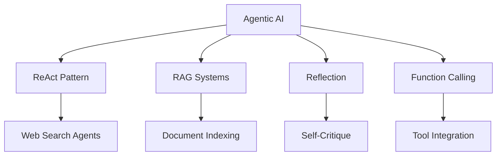

# 🤖 Agentic AI Learning Repository

A comprehensive exploration of agentic AI systems using LangChain, LangGraph, and modern LLM frameworks.


---

## 📚 Learning Journey

This repository documents my exploration of building intelligent agents with various architectures and capabilities.

### 🎯 Core Concepts Explored



---

## 🗂️ Repository Structure

### 1. **ReAct Pattern Implementations**
- `1.LC_WebSearchAgentReact.py` - LangChain-based ReAct agent with web search
- `2.LC_WebSearchAgentFunctionCalling.py` - Function-calling variant of ReAct
- `6.LG_ReActFunctionCalling.py` - LangGraph implementation with function calling

**Key Learning**: ReAct (Reasoning + Acting) enables agents to iteratively reason about problems and take actions based on observations.

### 2. **RAG (Retrieval-Augmented Generation)**
- `3.LC_RAGAgent.py` - Basic RAG implementation
- `4.FiassIndexingHNSWOpenai.py` - FAISS vector indexing with HNSW algorithm

**Key Learning**: RAG combines retrieval mechanisms with generation, enabling agents to access external knowledge bases dynamically.

### 3. **Reflection Mechanisms**
- `7.LG_ReflectionAgent.py` - Self-reflective agent with critique capability
- `8.LG_ReflexionAgent.py` - Enhanced reflexion pattern

**Key Learning**: Reflection patterns allow agents to critique and improve their own outputs through iterative refinement.

### 4. **Applied AI Systems**
- Featured Project: **UIDS-II** - Vehicle-model agnostic intrusion detection system using zero-shot temporal learning on BERT for automotive CAN networks

---

## 🛠️ Tech Stack

| Component | Technology |
|-----------|-----------|
| **Framework** | LangChain, LangGraph |
| **LLM Providers** | OpenAI (GPT-4), Google Gemini, Meta Llama |
| **Vector Store** | FAISS with HNSW indexing |
| **Search Tools** | Tavily Search API |
| **Custom Tools** | Structured tool integration |
| **State Management** | LangGraph StateGraph |

---

## 🚀 Architecture Patterns

### ReAct Agent Flow
```
User Query → Reasoning Step → Action Selection → Tool Execution → Observation → Repeat
```

### RAG Agent Flow
```
User Query → Document Retrieval → Context Augmentation → LLM Generation → Response
```

### Reflection Agent Flow
```
Initial Response → Self-Critique → Refinement → Final Output
```

---

## 📦 Setup

```bash
# Clone repository
git clone https://github.com/Arupreza/Agents.git
cd Agents

# Install dependencies
pip install -r requirements.txt

# Configure environment
cp .env.example .env
# Add your API keys to .env
```

---

## 🎓 Key Takeaways

1. **Agent Architectures**: Learned multiple patterns including ReAct, RAG, and Reflection
2. **Framework Evolution**: Progressed from LangChain (LC) to LangGraph (LG) for better state management
3. **Tool Integration**: Implemented external tool calling for web search and document retrieval
4. **Iterative Improvement**: Explored self-critique mechanisms for output quality enhancement
5. **Applied Research**: Bridged theory with practical applications in automotive security

---

## 📖 Learning Resources

- LangChain Documentation
- LangGraph Documentation
- ReAct Paper: "ReAct: Synergizing Reasoning and Acting in Language Models"
- RAG Paper: "Retrieval-Augmented Generation for Knowledge-Intensive NLP Tasks"

---

## 🔮 Future Directions

- [ ] Multi-agent systems and collaboration
- [ ] Advanced memory mechanisms
- [ ] Tool-use optimization
- [ ] Production deployment patterns
- [ ] Rust implementations for performance-critical components

---

## 📄 License

MIT License - See LICENSE file for details

---

**Note**: This repository represents active learning. Code quality and patterns evolve as understanding deepens.