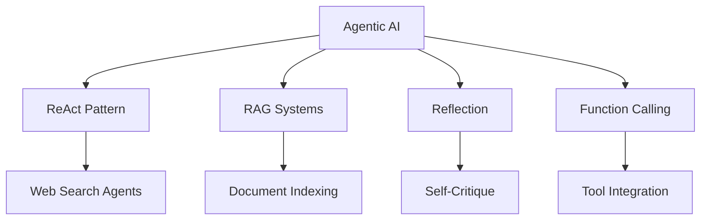

# 🤖 Agentic AI Learning Repository

A comprehensive exploration of agentic AI systems using LangChain, LangGraph, and modern LLM frameworks.


---

### 8. Corrective RAG (CRAG) (`9.LG_CorrectiveRAG/`)

```
[ User Question ]
      ↓
┌─────────────────────┐
│   retrieve          │ ← VectorStoreRetriever: FAISS similarity search
│   (Node)            │
└─────────────────────┘
      ↓
┌─────────────────────┐
│ grade_documents     │ ← LLM judges: "relevant" or "not relevant"
│ (Node)              │    for each retrieved doc
└─────────────────────┘
      ↓
┌─────────────────────┐
│ decide_to_generate  │ ← Conditional Edge (Router)
│ (Decision Gate)     │
└─────────────────────┘
      │                    │
      │ "web_search"       │ "generate"
      ↓                    ↓
┌─────────────────┐   ┌─────────────────────┐
│  web_search     │   │     generate        │ ← LLM synthesizes answer
│  (Node)         │   │     (Node)          │    from relevant docs
│  Tavily API     │   └─────────────────────┘
└─────────────────┘               ↓
      │                        [ END ]
      │
      └──→ generate (with web results)
```

**Workflow Logic**:
```python
if any_doc_relevant:
    # At least one doc is relevant
    if all_docs_relevant:
        # All docs relevant → direct generation
        return "generate"
    else:
        # Some docs irrelevant → augment with web search
        return "web_search"
else:
    # No relevant docs → fallback to web search only
    return "web_search"
```

**Key Components**:

**Chains** (Modular Prompt + LLM combinations):
- `retrieval_grader.py`: Binary classifier (relevant/not relevant) with structured output
- `generation.py`: RAG chain that synthesizes answer from context

**Nodes** (Graph execution units):
- `retrieve.py`: Fetches top-k documents from FAISS vector store
- `grade_documents.py`: Filters documents, keeps only relevant ones
- `web_search.py`: Falls back to Tavily search when retrieval insufficient
- `generate.py`: Final answer generation with context

**Architecture Benefits**:
- **Self-Correcting**: Validates retrieval quality before generation
- **Hybrid Approach**: Combines local knowledge (FAISS) + real-time web search
- **Modular Design**: Chains and nodes are independently testable
- **Structured Outputs**: Pydantic models ensure reliable grading (binary: yes/no)
- **Performance Metrics**: LangSmith tracing shows retrieval (2.97s) and grading overhead (5.68s)

**State Flow**:
```python
class GraphState(TypedDict):
    question: str              # User query
    documents: List[Document]  # Retrieved docs
    generation: str            # Final answer
    web_search: str           # Flag: "Yes" to trigger search
```

---

## 📚 Learning Journey

This repository documents my exploration of building intelligent agents with various architectures and capabilities.

### 🎯 Core Concepts Explored



---

## 🗂️ Repository Structure

### 1. **ReAct Pattern Implementations**
- `1.LC_WebSearchAgentReact.py` - LangChain-based ReAct agent with web search
- `2.LC_WebSearchAgentFunctionCalling.py` - Function-calling variant of ReAct
- `6.LG_ReActFunctionCalling.py` - LangGraph implementation with function calling

**Key Learning**: ReAct (Reasoning + Acting) enables agents to iteratively reason about problems and take actions based on observations.

### 2. **RAG (Retrieval-Augmented Generation)**
- `3.LC_RAGAgent.py` - Basic RAG implementation
- `4.FiassIndexingHNSWOpenai.py` - FAISS vector indexing with HNSW algorithm

**Key Learning**: RAG combines retrieval mechanisms with generation, enabling agents to access external knowledge bases dynamically.

### 3. **Reflection Mechanisms**
- `7.LG_ReflectionAgent.py` - Self-reflective agent with critique capability
- `8.LG_ReflexionAgent.py` - Enhanced reflexion pattern

**Key Learning**: Reflection patterns allow agents to critique and improve their own outputs through iterative refinement.

### 4. **Corrective RAG (CRAG)**
- `9.LG_CorrectiveRAG/` - Corrective RAG with fallback web search
  - `chains/generation.py` - Answer generation chain
  - `chains/retrieval_grader.py` - Document relevance grading
  - `nodes/generate.py` - Generation node
  - `nodes/grade_documents.py` - Document grading node
  - `nodes/retrieve.py` - Vector store retrieval
  - `nodes/web_search.py` - Fallback web search
  - `main.py` - Complete CRAG workflow

**Key Learning**: Corrective RAG evaluates retrieval quality and falls back to web search when local knowledge is insufficient, combining best of both retrieval and search paradigms.

---

## 🛠️ Tech Stack

| Component | Technology |
|-----------|-----------|
| **Framework** | LangChain, LangGraph |
| **LLM Providers** | OpenAI (GPT-4), Google Gemini, Meta Llama |
| **Vector Store** | FAISS with HNSW indexing |
| **Search Tools** | Tavily Search API |
| **Custom Tools** | Structured tool integration |
| **State Management** | LangGraph StateGraph |

---

## 🏗️ Architecture Patterns

### 1. ReAct Agent with LangGraph (`1.LC_WebSearchAgentReact.py`)

```
System Prompt (ReAct Instructions)
          ↓
User Query → Agent Node (LLM with Tools)
          ↓
    Decision Point
          ↓
    ┌─────┴─────┐
    │           │
Tool Calls?   No Tool Calls
    │           │
    ↓           ↓
Tool Node    END (Final Response)
    │
    ↓
Tool Results → Agent Node (Reasoning)
    │
    └──→ (Loop until complete)
```

**Key Components**:
- **State Management**: `AgentState` with message accumulation via `add_messages`
- **Conditional Routing**: `should_continue()` checks for tool calls
- **Graph Structure**: Agent ↔ Tools cyclic connection until termination
- **Tool Binding**: LLM bound to tools via `.bind_tools()`
- **Declarative Flow**: LangGraph handles execution loop automatically

---

### 2. Function Calling Agent (`2.LC_WebSearchAgentFunctionCalling.py`)

```
[ User Query ]
      ↓
┌─────────────────────┐
│ Initialize State    │ ← System Prompt + Message History
└─────────────────────┘
      ↓
┌─────────────────────┐
│   REASONING         │ ← LLM: "What should I do next?"
│  (llm_with_tools)   │
└─────────────────────┘
      ↓
   Decision
      ↓
┌──────────┬──────────┐
│          │          │
Tool Calls?│    Final Answer?
│          │          │
↓          │          ↓
┌─────────────────────┐  ┌─────────────────────┐
│   ACTION (ACT)      │  │  Output to User     │
│ - Find Tool         │  └─────────────────────┘
│ - Validate Args     │            ↓
│ - Execute .invoke() │         [ END ]
└─────────────────────┘
      ↓
┌─────────────────────┐
│   OBSERVATION       │
│ - Add ToolMessage   │
│ - Append to History │
└─────────────────────┘
      ↓
      └──→ Back to REASONING (Loop)
```

**Key Components**:
- **Model Agnostic**: Factory pattern supports OpenAI, Anthropic, Google via `get_model()`
- **Explicit Loop Control**: Manual `while` loop with iteration tracking and max_iterations safety
- **Tool Execution**: Decoupled `_execute_tool_call()` method for extensibility
- **State Persistence**: All messages (System, Human, AI, Tool) tracked in AgentState
- **Provider Switching**: Change one line to swap LLM providers

**Variable Flow**:
```
Persistent State:
- messages [List]: Conversation memory
- max_iterations [Int]: Safety limit (default: 10)

System-Sourced:
- system_prompt [Str]: Agent behavioral instructions
- tool_args [Dict]: Extracted from response.tool_calls["args"]
- tool_result [Str]: Output from tool.function.invoke()

Human-Sourced:
- user_query [Str]: Initial task

Brain-Sourced (LLM):
- response.content [Str]: Text generation
- response.tool_calls [List]: Function call requests with id and args
```

---

### 3. RAG Agent (`3.LC_RAGAgent.py`)

```
User Query
    ↓
┌─────────────────────┐
│  search_papers      │ ← Tool decorated with @tool
│  (Vector Search)    │
└─────────────────────┘
    ↓
┌─────────────────────┐
│ FAISS.similarity    │ ← Retrieve top-k documents
│ _search(query, k=3) │
└─────────────────────┘
    ↓
┌─────────────────────┐
│ Retrieved Docs      │ ← Source + Page + Content
└─────────────────────┘
    ↓
┌─────────────────────┐
│  LLM (Gemini)       │ ← Generate answer with context
│  + System Prompt    │
└─────────────────────┘
    ↓
┌─────────────────────┐
│ Final Answer        │ ← With citations
└─────────────────────┘
```

**Key Components**:
- **Vector Store**: FAISS loaded from pre-built index
- **Embeddings**: OpenAI `text-embedding-3-small` for queries
- **Tool Definition**: `@tool` decorator wraps retrieval function
- **Agent Creation**: Modern `create_agent()` with `system_prompt` parameter
- **Message Format**: Invoked with `{"messages": [("user", query)]}`

---

### 4. FAISS Vector Indexing (`4.FiassIndexingHNSWOpenai.py`)

```
[ PDF Documents ]
      ↓
┌─────────────────────┐
│ DirectoryLoader     │ ← Load all PDFs from directory
└─────────────────────┘
      ↓
┌─────────────────────┐
│ Text Splitter       │ ← chunk_size=800, overlap=120
└─────────────────────┘
      ↓
┌─────────────────────┐
│ Batch Processing    │ ← Process BATCH_SIZE chunks at a time
│ (Prevents Timeout)  │
└─────────────────────┘
      ↓
      Loop for each batch:
      ↓
┌─────────────────────┐
│ OpenAI Embeddings   │ ← text-embedding-3-small (dim=1536)
└─────────────────────┘
      ↓
┌─────────────────────┐
│ FAISS HNSW Index    │ ← IndexHNSWFlat with M=64, efConstruction=200
└─────────────────────┘
      ↓
┌─────────────────────┐
│ vectorstore.add     │ ← Add batch to index
│ _documents(batch)   │
└─────────────────────┘
      ↓
      time.sleep(0.5)  ← Rate limit protection
      ↓
[ Next Batch or Save ]
```

**Key Components**:
- **HNSW Algorithm**: Fast approximate nearest neighbor search
- **Batch Processing**: Prevents API timeouts and respects rate limits
- **Configurable**: BATCH_SIZE, chunk_size, overlap adjustable
- **Persistence**: Saves to disk with `save_local()`, loads with `load_local()`
- **Parameters**: M=64 (connections per node), efConstruction=200 (build quality)

---

### 5. LangGraph ReAct with Function Calling (`6.LG_ReActFunctionCalling.py`)

```
[ START ]
    ↓
┌─────────────────────┐
│  agent_reason       │ ← LLM with tools + System prompt
│  (Node)             │    "Should I use a tool or answer?"
└─────────────────────┘
    ↓
┌─────────────────────┐
│ should_continue?    │ ← Conditional Edge (Router)
│ (Decision Gate)     │
└─────────────────────┘
    │              │
    │ "ACT"        │ "END"
    ↓              ↓
┌─────────────┐  ┌─────┐
│   act       │  │ END │ ← Final result
│ (ToolNode)  │  └─────┘
└─────────────┘
    │
    └──→ Back to agent_reason (Loop)
```

**Key Components**:
- **Multi-Tool Support**: Combines Tavily Search + custom fahrenheit_converter
- **System Prompt Engineering**: Enforces specific tool usage sequence
- **Conditional Router**: `Literal["ACT", "END"]` type hints for clarity
- **Tool Execution**: Prebuilt `ToolNode` handles automatic tool invocation
- **Loop Mechanism**: `add_edge("act", "agent_reason")` creates reasoning loop
- **Recursion Limit**: Configurable safety via `config={"recursion_limit": 10}`

---

### 6. Reflection Agent (`7.LG_ReflectionAgent.py`)

```
[ START ]
    ↓
┌─────────────────────┐
│  GENERATE (Node)    │ ← generation_chain: Write/Revise tweet
└─────────────────────┘
    ↓
┌─────────────────────┐
│ Condition Check:    │ ← len(messages) >= 6?
│ messages >= 6?      │
└─────────────────────┘
    │              │
    │ YES          │ NO
    ↓              ↓
┌─────┐      ┌─────────────┐
│ END │      │  REFLECT    │ ← reflection_chain: Critique
└─────┘      │  (Node)     │
             └─────────────┘
                   │
                   └──→ Back to GENERATE (Loop)
```

**Key Components**:
- **Dual Chains**: Separate prompts for generation vs reflection
- **Message Accumulation**: `add_messages` annotation appends instead of overwrites
- **Iteration Limit**: Stops at 6 messages (3 generate-reflect cycles)
- **Prompt Engineering**: System prompts define critic vs creator personas
- **HumanMessage Wrapping**: Reflection output wrapped as HumanMessage for generator

---

### 7. Reflexion Agent (`8.LG_ReflexionAgent.py`)

```
[ START ]
    ↓
┌─────────────────────┐
│  draft (Node)       │ ← first_responder: Answer + Reflection + Queries
└─────────────────────┘
    ↓
┌─────────────────────┐
│ execute_tools       │ ← run_queries: Batch Tavily searches
│ (ToolNode)          │
└─────────────────────┘
    ↓
┌─────────────────────┐
│  revise (Node)      │ ← revisor: Incorporate search results + Citations
└─────────────────────┘
    ↓
┌─────────────────────┐
│ event_loop          │ ← Check ToolMessage count
│ (Conditional)       │
└─────────────────────┘
    │                │
    │ count >= 2     │ count < 2
    ↓                ↓
┌─────┐      ┌──────────────┐
│ END │      │ execute_tools│ ← Loop back for more research
└─────┘      └──────────────┘
                   │
                   └──→ Back to revise
```

**Key Components**:
- **Structured Outputs**: Pydantic models (Reflection, AnswerQuestion, ReviseAnswer)
- **Tool Choice Enforcement**: `tool_choice="AnswerQuestion"` forces structured response
- **Batch Search**: `run_queries()` processes multiple queries via `.batch()`
- **Self-Reflection Schema**: Missing/superfluous fields guide improvement
- **Citation System**: Numerical references [1], [2] with References section
- **Iteration Control**: Limits to 2 tool executions via ToolMessage count
- **Temporal Context**: `datetime.now().isoformat()` in prompt for time-aware responses

---

## 🚀 Quick Start

```bash
# Clone repository
git clone https://github.com/Arupreza/Agents.git
cd Agents

# Install dependencies
pip install -r requirements.txt

# Configure environment
cp .env.example .env
# Add your API keys:
# - OPENAI_API_KEY
# - GEMINI_API_KEY
# - TAVILY_API_KEY
```

---

## 🎓 Key Takeaways

1. **Progressive Complexity**: Started with simple ReAct loops, progressed to multi-agent reflection systems
2. **Framework Comparison**: Explored both LangChain's imperative style and LangGraph's declarative approach
3. **Model Agnosticism**: Built provider-agnostic agents supporting OpenAI, Anthropic, and Google
4. **Tool Integration**: Learned web search, vector retrieval, and custom tool creation
5. **Prompt Engineering**: Discovered system prompts critically shape agent behavior
6. **State Management**: Mastered message accumulation patterns and iteration control
7. **Production Considerations**: Implemented batch processing, rate limiting, and error handling

---

## 📖 Learning Resources

- [LangChain Documentation](https://python.langchain.com/)
- [LangGraph Documentation](https://langchain-ai.github.io/langgraph/)
- [ReAct Paper](https://arxiv.org/abs/2210.03629): "ReAct: Synergizing Reasoning and Acting in Language Models"
- [RAG Paper](https://arxiv.org/abs/2005.11401): "Retrieval-Augmented Generation for Knowledge-Intensive NLP Tasks"
- [Reflexion Paper](https://arxiv.org/abs/2303.11366): "Reflexion: Language Agents with Verbal Reinforcement Learning"

---

## 🔮 Future Directions

- [ ] Multi-agent collaboration and communication protocols
- [ ] Long-term memory mechanisms (vector + graph hybrid)
- [ ] Production deployment patterns (FastAPI + Docker)
- [ ] Agent evaluation frameworks and benchmarking
- [ ] Rust implementations for performance-critical components
- [ ] Cost optimization strategies for production LLM systems

---

## 📄 License

MIT License - See LICENSE file for details

---

**Note**: This repository represents active learning. Code quality and patterns evolve as understanding deepens.